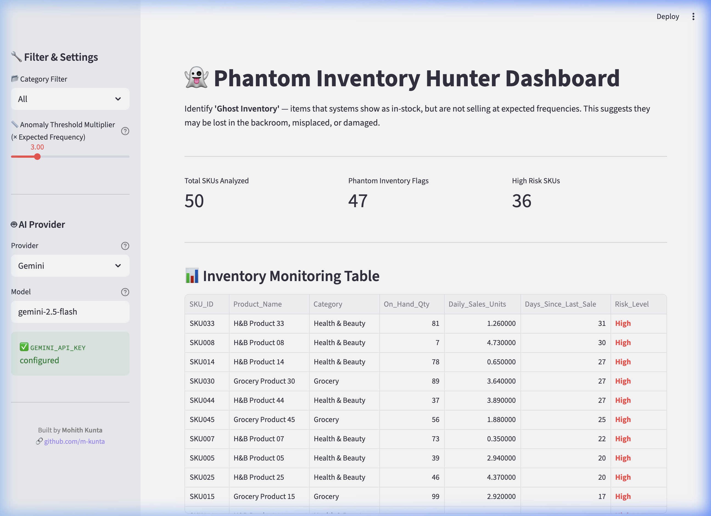
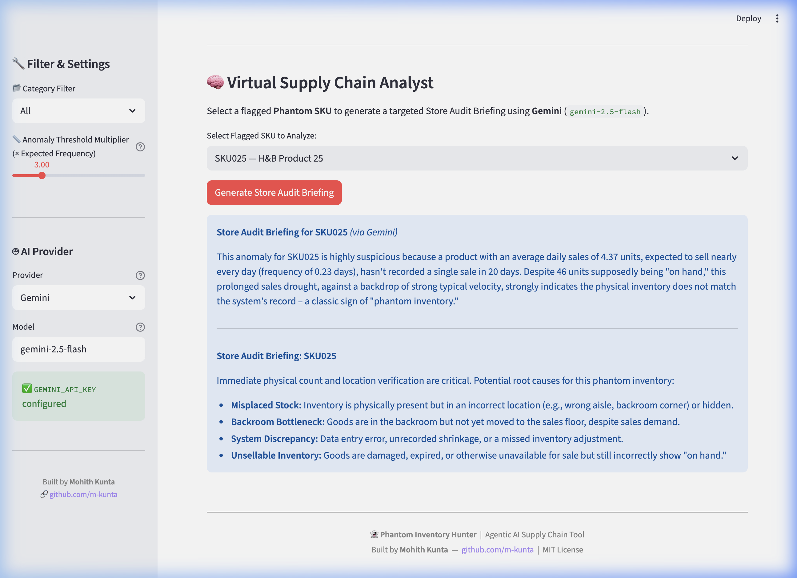
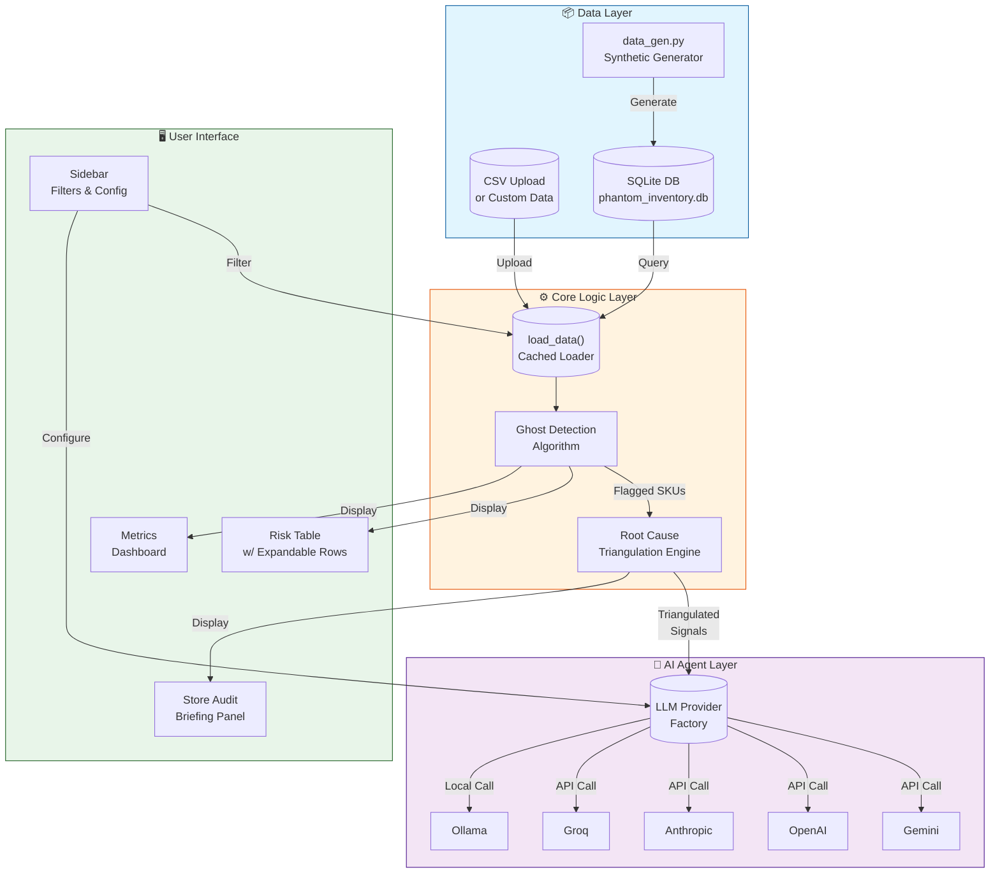
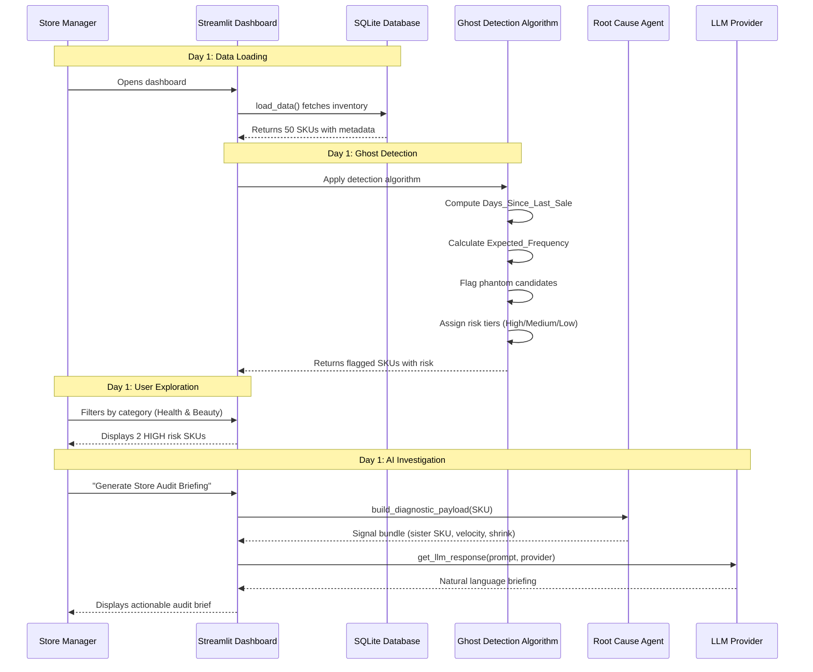

# 👻 Phantom Inventory Hunter

> **AI-powered Ghost Inventory Detection for Retail Supply Chain**

[](https://www.python.org/)
[](https://streamlit.io/)
[](https://ai.google.dev/)
[](https://opensource.org/licenses/MIT)

**Author:** Mohith Kunta  
**GitHub:** [github.com/m-kunta](https://github.com/m-kunta)

> 💡 **New to coding?** See the [📘 Non-Technical Quick Start Guide](QUICKSTART.md) for step-by-step instructions — from installing Python to getting your first API key.

---

## 🔍 What is Phantom Inventory?

**Phantom Inventory Hunter** is a prototype data science application designed to identify retail "ghost inventory"—items that the system believes are in stock, but are not selling at expected probabilistic frequencies.



This tool bridges the gap between raw statistical anomalies and actionable retail operations by leveraging **Agentic AI** to analyze flagged SKUs and generate prioritized store audit briefings.

**Phantom Inventory** (also called "Ghost Inventory") is a critical retail supply chain problem where a store's inventory management system records an item as **in-stock**, but the product is effectively **unavailable for sale** — because it's:

- 📦 **Misplaced** in a backroom or wrong shelf location
- 🛑 **Damaged** but not yet removed from the system
- 🔄 **Stuck** in a backroom receiving bottleneck
- 🖥️ Involved in a **system discrepancy** (shrinkage, miscounting)

Phantom inventory directly causes **lost sales**, **poor customer experience**, and **flawed replenishment decisions**.

This tool detects potential phantom inventory by flagging SKUs that:
1. Show **positive On-Hand Quantity** in the system
2. Have **not sold** for far longer than their historical velocity would suggest

---

## 📋 Business Case

### The Problem

Every retail organization faces a silent revenue killer that hides in plain sight within their inventory management system. **Phantom Inventory** — also called "Ghost Inventory" or "Invisible Stock" — occurs when your system shows products as available on the shelf, but customers literally cannot find them to buy.

**The business impact is devastating:**

| Impact Area | Real-World Consequence |
|---|---|
| 🛒 **Lost Sales** | Customer picks up an empty shelf, walks to a competitor, never returns |
| 😤 **Customer Frustration** | "I saw it online but you don't have it" — erode trust in your brand |
| 📉 **Poor Replenishment** | System believes stock is fine → no reorder → chronic out-of-stocks on popular items |
| 💸 **Inflated Inventory Value** | You think you have $50K in goods, but $8K is actually missing |
| 📦 **Labor Waste** | Staff spends hours searching backrooms for "lost" product that isn't there |

A major retailer can lose **2-4% of annual revenue** to phantom inventory — that's billions lost across the industry.

### Who This Solves For

Phantom Inventory Hunter is designed for three key personas in every retail operation:

#### 👩‍💼 Store Manager
**"I need to know which SKUs are bleeding money right now."**

- Visibility into top 10 phantom candidates across the store
- Prioritized audit list with High/Medium/Low risk tiers
- Actionable briefings generated in plain English — no data science background needed
- Just tell my floor associate: "Check backroom bin 3 for SKU1042, likely misplaced"

#### 👷‍♀️ Floor Associate / Stock Clerk
**"Where should I actually look for this product?"**

- The AI generates a specific location to check: backroom receiving, top-stock, damaged bin, or different aisle
- No more guessing — no more wasted 20-minute searches for a product that isn't there
- Clear instructions: "Sister SKU 1042 is selling fast — your customers are substituting. Check aisle 3 endcap first"

#### 📊 Inventory Controller / Supply Chain Analyst
**"I need to understand why sales dropped in Health & Beauty last month."**

- Category-level velocity analysis — flag entire aisles with operational blockages
- Triangulation engine identifies root cause patterns: shelf voids, blockages, or shrinkage
- Historical shrink scores tell you which SKUs have elevated theft risk

### How It Works: Real-World Example

**Scenario:** You run a grocery store in Ohio. Every Tuesday, you reorder dairy — or so you think.

1. **The Data Tells a Different Story:** Out of 500 SKUs in Dairy, 47 show positive on-hand quantity but haven't sold in 14+ days despite averaging 3+ sales per day.

2. **The App Flags It:** Phantom Inventory Hunter identifies SKU "MILK-OAT-64Z" as a **HIGH** risk phantom — it's been 28 days since the last sale, but historically it sells 5 units daily.

3. **The AI Investigates:**
   - Triangulation engine checks: Sister SKU "MILK-ALM-64Z" is selling 40% above category mean
   - Category velocity index is normal (0.89)
   - Shrink score is low (0.12)
   - **Conclusion:** Shelf void — customers are buying the oat milk alternative instead

4. **Store Manager Gets a Clear Brief:**
   > "SKU MILK-OAT-64Z appears to be missing from the shelf. Customers are substituting with the almond milk alternative (MILK-ALM-64Z), which is selling 40% above the category average. Check the following locations in order: (1) Dairy aisle endcap (competitor placement), (2) Morning stock cart in backroom receiving, (3) Overstock bin in aisle 4."

5. **The Fix:** Associate finds the product — was misplaced during Tuesday morning restock. Re-shelves it. Within 3 days, sales return to normal. **$1,200 in weekly lost sales recovered.**

### User-Facing Benefits

| Benefit | Who Benefits Most | Bottom Line Impact |
|---|---|---|
| ⚡ **Real-Time Detection** | Store Manager | Identify problems before quarterly inventory audit |
| 🎯 **Prioritized Audit List** | Floor Associate | Reduce audit time from 4 hours to 45 minutes |
| 🧠 **AI-Powered Root Cause** | Store Manager / Inventory Controller | Understand WHY — not just WHICH items |
| 📈 **Category Velocity Insights** | Inventory Controller | Spot aisle-wide operational issues |
| 🔒 **Shrinkage Risk Scoring** | Loss Prevention | Proactively identify high-theft SKUs |
| 📱 **No Technical Skills Required** | All Users | Deploy in hours, not months |

---

## ✨ Features

| Feature | Description |
|---|---|
| 🔬 **Ghost Detection Algorithm** | Flags SKUs where `Days Since Last Sale > N × Expected Sale Frequency` |
| 🎛️ **Adjustable Sensitivity** | A sidebar slider lets you tune the N-multiplier threshold interactively |
| 📊 **Risk Tiering** | Automatically classifies flagged items as **High** / **Medium** / **Low** risk |
| 🧠 **AI Store Audit Briefings** | Powered by Google Gemini — click any flagged SKU for a plain-English root-cause analysis |
| 🔎 **Root Cause Signals** *(new)* | Each SKU carries shrink score, category velocity, sister SKU, and location status for diagnostic triangulation |
| 📁 **Custom Data Upload** | Upload your own custom inventory data via CSV in the sidebar |
| 🗂️ **Category Filtering** | Filter by `Health & Beauty` or `Grocery` in the sidebar |
| 💾 **SQLite Persistence** | All data stored locally in a lightweight SQLite database |
| ⚡ **Streamlit Dashboard** | Interactive, real-time, filterable UI with color-coded risk levels |

### 3. Agentic AI Root Cause Analysis

Clicking **"Generate Store Audit Briefing"** passes the anomaly context to an LLM provider of your choice. The LLM acts as a Virtual Supply Chain Analyst, generating a concise, readable brief for store associates explaining *why* the item is flagged and *where* they should look for it (e.g., specific backroom areas, top-stock, damaged bins).



**Provider Support:** The app includes a flexible factory class (`LLMProvider`) that currently supports:

---

## 🏗️ Architecture

```
phantom_inventory/
├── app.py                   # Main Streamlit dashboard & AI interface
├── llm_providers.py         # Provider factory (Gemini/OpenAI/Anthropic/Groq/Ollama)
├── data_gen.py              # Synthetic data engine (SQLite generator)
├── root_cause_agent.py       # Triangulation engine — Root Cause AI Agent
├── phantom_inventory.db     # Auto-generated SQLite database (git-ignored)
├── requirements.txt        # Python dependencies
├── .env                    # Your secret API keys (git-ignored)
├── .env.example            # Safe template to share with collaborators
├── .gitignore              # Excludes .env, .venv/, *.db, __pycache__/
├── ROOT_CAUSE_AGENT.md     # Feature specification for the diagnostic agent
├── QUICKSTART.md           # Non-technical setup guide
└── README.md               # This file
```

### System Architecture



### Data Flow



### Component Responsibilities

| Component | File | Responsibility |
|---|---|---|
| **Dashboard** | `app.py` | UI, filters, ghost detection loop, audit briefing trigger |
| **Data Generator** | `data_gen.py` | Synthetic SKU generation with diagnostic signals |
| **Triangulation Engine** | `root_cause_agent.py` | Classifies root cause type (shelf void / blockage / shrink) |
| **Provider Factory** | `llm_providers.py` | Unified interface to Gemini, OpenAI, Anthropic, Groq, Ollama |
| **Database** | `phantom_inventory.db` | Local persistence — 50 SKUs with 8 fields each |

---

## 🔬 The Ghost Detection Algorithm

The core detection logic is simple but effective:

**Step 1 — Calculate Expected Sale Frequency:**
```
Expected_Frequency (days) = 1 / Daily_Sales_Units
```
*e.g., a SKU with 0.5 avg daily sales → expected to sell once every 2 days*

**Step 2 — Flag Phantom Candidates:**
```
Is_Phantom = (On_Hand_Qty > 0) AND (Days_Since_Last_Sale > Threshold × Expected_Frequency)
```
*Default threshold: 3× (configurable via the sidebar slider from 1× to 10×)*

**Step 3 — Assign Risk Level:**
```
deviation_ratio = Days_Since_Last_Sale / (Expected_Frequency × Threshold)
  • deviation_ratio ≥ 2  →  HIGH risk
  • deviation_ratio < 2  →  MEDIUM risk
  • Not flagged          →  LOW risk
```

---

## 🤖 The AI Analyst (Agentic Layer)

The app features a **provider-agnostic AI layer** (`llm_providers.py`) built on the Strategy Pattern. You can switch providers live from the **sidebar** without restarting the app, or set a default via `.env`.

### Supported Providers

| Provider | Package | Free Tier | Default Model | Key in `.env` |
|---|---|---|---|---|
| **Gemini** *(default)* | `google-genai` | ✅ Yes | `gemini-2.5-flash` | `GEMINI_API_KEY` |
| **OpenAI** | `openai` | ❌ Paid | `gpt-4o-mini` | `OPENAI_API_KEY` |
| **Anthropic** | `anthropic` | ❌ Paid | `claude-3-5-haiku-latest` | `ANTHROPIC_API_KEY` |
| **Groq** | `groq` | ✅ Yes | `llama-3.3-70b-versatile` | `GROQ_API_KEY` |
| **Ollama** | `ollama` | ✅ Free (local) | `llama3.2` | *(none needed)* |

### How Switching Works

1. **Sidebar** — Select any provider from the dropdown in the running app. Change models by editing the model text box. You can securely enter your API key directly in the sidebar, or update an existing one.
2. **`.env`** — Set `LLM_PROVIDER=Groq` (or any name) to make a provider the persistent default.
3. **Missing packages** — If a provider's SDK isn't installed, the app shows a friendly install hint instead of crashing.

### Adding Ollama (fully local, free)

```bash
# 1. Install Ollama: https://ollama.com
# 2. Pull a model
ollama pull llama3.2
# 3. Select "Ollama" in the sidebar — no API key needed!
```

### Adding Groq (free API, fastest inference)

```bash
# Get a free API key at https://console.groq.com
# Add to .env:
GROQ_API_KEY=your_groq_api_key_here
```

---

## 🚀 Getting Started

### Prerequisites

- Python 3.9+ — [download here](https://www.python.org/downloads/)
- An API key for at least one AI provider (see below — free options available)

> 💡 **First time?** Follow the [QUICKSTART.md](QUICKSTART.md) guide instead — it explains everything in plain language.

### Getting an AI API Key

You only need **one** of these. Pick whichever suits you:

| Provider | Cost | Link | Time |
|---|---|---|---|
| **Gemini** *(recommended)* | 🆓 Free | [aistudio.google.com/app/apikey](https://aistudio.google.com/app/apikey) | 2 min |
| **Groq** | 🆓 Free | [console.groq.com](https://console.groq.com) | 3 min |
| **Ollama** | 🆓 Free (local) | [ollama.com](https://ollama.com) — no account needed | 5 min |
| **OpenAI** | 💳 Paid | [platform.openai.com/api-keys](https://platform.openai.com/api-keys) | 5 min |
| **Anthropic** | 💳 Paid | [console.anthropic.com](https://console.anthropic.com) | 5 min |

#### Gemini (step-by-step)
1. Sign in at [aistudio.google.com/app/apikey](https://aistudio.google.com/app/apikey) with your Google account
2. Click **"Create API Key"**
3. Copy the key — paste it into your `.env` file as `GEMINI_API_KEY=...`

#### Groq (step-by-step)
1. Sign up free at [console.groq.com](https://console.groq.com)
2. Go to **API Keys** → **Create API Key** → copy it
3. Paste into `.env` as `GROQ_API_KEY=...` and set `LLM_PROVIDER=Groq`

#### Ollama — no account needed
1. Download and install from [ollama.com](https://ollama.com)
2. In terminal: `ollama pull llama3.2`
3. Select **"Ollama"** in the app sidebar — no key required

### Installation

**1. Clone the repository:**
```bash
git clone https://github.com/m-kunta/phantom-inventory-hunter-agentic-ai.git
cd phantom-inventory-hunter-agentic-ai
```

**2. Create and activate a virtual environment:**
```bash
python3 -m venv .venv
source .venv/bin/activate       # macOS/Linux
# .venv\Scripts\activate        # Windows
```

**3. Install dependencies:**
```bash
pip install -r requirements.txt
```

**4. Configure your Gemini API Key:**

Copy the example env file and fill in your key — do **not** edit `app.py` directly:
```bash
cp .env.example .env
# Then open .env and set:
# GEMINI_API_KEY=your_actual_key_here
```
Get a free API key at [aistudio.google.com/app/apikey](https://aistudio.google.com/app/apikey).

**5. Generate synthetic data (or use your own):**
```bash
python data_gen.py
```
> **Tip:** Data is seeded (default `seed=42`) so the same dataset is generated on every run. Pass a different seed to get a new dataset: `python -c "from data_gen import generate_synthetic_data; generate_synthetic_data(seed=99)"`
>
> **Have your own data?** You can skip generation and upload your own `.csv` file directly in the app sidebar. Core required columns: `SKU_ID`, `Product_Name`, `Category`, `On_Hand_Qty`, `Daily_Sales_Units`, `Last_Sale_Date`. For Root Cause Agent diagnostics, also include: `Sister_SKU_ID`, `Category_Velocity_Index`, `Historical_Shrink_Score`, `Location_Status`.

**6. Launch the dashboard:**
```bash
streamlit run app.py
```

The app will open at **http://localhost:8501** 🎉

---

## 📦 Data Schema

The `inventory` table in `phantom_inventory.db` follows this schema:

**Core fields:**

| Column | Type | Description |
|---|---|---|
| `SKU_ID` | TEXT | Unique product identifier (e.g., `SKU001`) |
| `Product_Name` | TEXT | Human-readable product name |
| `Category` | TEXT | `Health & Beauty` or `Grocery` |
| `On_Hand_Qty` | INTEGER | Current stock quantity in the system |
| `Daily_Sales_Units` | FLOAT | Average daily sold units (velocity) |
| `Last_Sale_Date` | DATE | Date of the most recent recorded sale |

**Root Cause Agent fields** *(added in v0.2 — generated by `data_gen.py`)*:

| Column | Type | Description |
|---|---|---|
| `Sister_SKU_ID` | TEXT | ID of the closest substitute product in the same category |
| `Category_Velocity_Index` | FLOAT | Ratio of current 7-day category sales to baseline — values < 0.20 signal an Operational Blockage |
| `Historical_Shrink_Score` | FLOAT | Theft/loss risk rating 0.0–1.0 — values > 0.75 combined with zero sales signal Inventory Inaccuracy or Theft |
| `Location_Status` | TEXT | Aisle operational state: `Open`, `Closed`, or `Restocking` |

**Computed fields** added at runtime by `app.py`:

| Column | Description |
|---|---|
| `Days_Since_Last_Sale` | Calculated from `Last_Sale_Date` vs today |
| `Expected_Frequency` | `1 / Daily_Sales_Units` |
| `Is_Phantom` | Boolean flag (detection algorithm output) |
| `Risk_Level` | `High`, `Medium`, or `Low` |

---

## 🛠️ Dependencies

```
streamlit           # Interactive dashboard framework
pandas              # Data manipulation and analysis
numpy               # Numerical operations
python-dotenv       # Loads API keys safely from .env file
google-genai        # Gemini AI — default provider

# Optional (install for your chosen alternative provider):
# openai            # OpenAI GPT-4o / GPT-4o-mini
# anthropic         # Anthropic Claude 3.5
# groq              # Groq (Llama 3, Mixtral) — free tier
# ollama            # Ollama — fully local, no key needed
```

---

## 💡 Roadmap

### 🔬 Root Cause AI Agent (Logic Complete)
> **Full spec:** [ROOT_CAUSE_AGENT.md](ROOT_CAUSE_AGENT.md)

Moves beyond *detecting* phantom inventory to *diagnosing why* it's happening using relational data signals and a heuristic triangulation engine before the LLM call.

| Signal | Diagnostic Flag | Meaning |
|---|---|---|
| Sister-SKU sales spike +20% | `SHELF_VOID` | Item missing from shelf, customers substituting |
| Category velocity < 20% baseline | `OPERATIONAL_BLOCKAGE` | Aisle closed / maintenance / reset |
| Shrink score > 0.75 + zero sales | `SHRINK_RISK` | Theft or inventory inaccuracy |

**Implementation progress:**
- [x] Extend `data_gen.py` with 4 diagnostic schema fields
- [x] Create `root_cause_agent.py` — Triangulation Engine
- [x] Update `llm_providers.py` for structured diagnostic payloads
- [x] Update `app.py` with diagnostic badges and Investigation Panel

---

### 🗃️ Other Future Enhancements

- [ ] **Real data connectors** (SAP, NetSuite, Shopify API)
- [ ] **Email/Slack alerts** for newly flagged High-risk SKUs
- [ ] **Historical trend charts** (7-day rolling sales velocity)
- [ ] **Multi-store support** with store-level filtering
- [ ] **Export to CSV/PDF** for store manager reports
- [ ] **ML anomaly scoring** as an alternative to rule-based thresholds

---

## 📄 License

This project is licensed under the **MIT License** — see the [LICENSE](LICENSE) file for full text.

**What this means:**
- ✅ Free to use for personal, academic, or commercial projects
- ✅ Free to modify and distribute
- ⚠️ You **must** keep the copyright notice (i.e., credit Mohith Kunta) in any copy or derivative work

---

## 👤 Author

**Mohith Kunta**  
Supply Chain & AI Portfolio Project  
🔗 [github.com/m-kunta](https://github.com/m-kunta)

---

*Built with ❤️ to solve real retail supply chain problems with modern AI tooling.*
